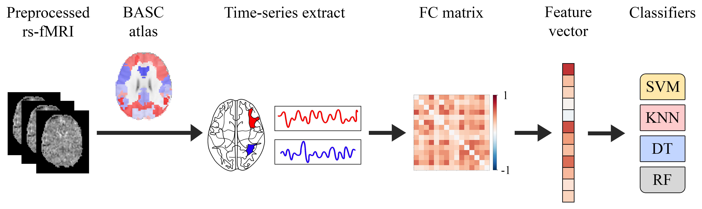

# A Benchmark of Preprocessing Strategies for Autism Classification from Resting-State Functional Magnetic Resonance Imaging

This repository is complemented by our paper XXXX which is published in XXXX.

## 1. Content

The current project contains three fundamental files and one folder. A brief description of each element is presented in the following lines:

1. `machine_learning_benchmark.ipynb`  
  This notebook contains all the processes necessary to reproduce the results of our paper.

2. `folds.pickle`  
  Since we use k-fold cross validation, this file stores the distribution of cases in each of the folds.

3. `Phenotypic_V1_0b_preprocessed1.csv`  
  This file is located inside the ABIDE_pcp folder and contains the phenotypic information of the patients covered by the Autism Brain Imaging Data Exchange I (ABIDE I) dataset.

4. `ABIDE_pcp`  
  It is important not to change the name of this folder, as it stores the rs-fMRI data that is downloaded. In addition, it contains the file that provides the phenotypic information of the patients.

## 2. Instructions

To replicate our results, go to the notebook and run each of the cells found there. 

## 3. Requirements

1. Google Colaboratory to run all the processes in the notebook.

2. Google Drive to store the data and files.

## 4. Description of the processes

The following is a brief description of the main processes found in the notebook :

1. Download rs-fMRI data from the four preprocessing strategies provided by the CPAC pipeline through Preprocessed Connectomes Project (PCP). We consider data from the NYU site which contains 175 subjects (75 autism patients and 100 normal patients).

2. Feature extraction of cases based on functional connectivity (FC). Specifically, a one-dimensional feature vector of length L = 2016 is obtained for each case. This process is briefly described in Fig. 1.

3. Training and evaluation of four machine learning (ML) models, namely, support vector machines (SVM), k-nearest neighbor (KNN), decision tree (DT) and random forest (RF), by 5-fold cross validation. 

4. Store and print the results of each ML model for each of the preprocessing strategies. For this, five performance measures are considered: accuracy, precision, f1-score, recall and specificity.

  
<figure>
  
  <figcaption>
  Fig. 1. Workflow implemented in our study which starts from the preprocessed rs-fMRI data, goes through the feature extraction process and culminates with the four ML classifiers.
  </figcaption>
</figure>

